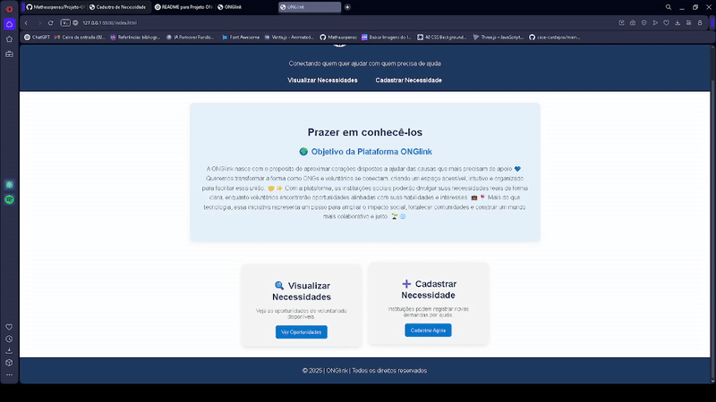
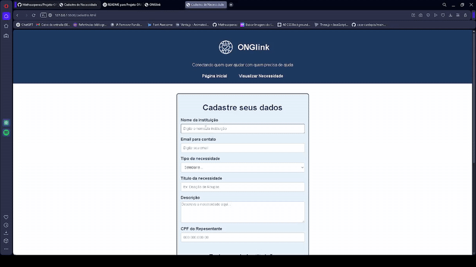
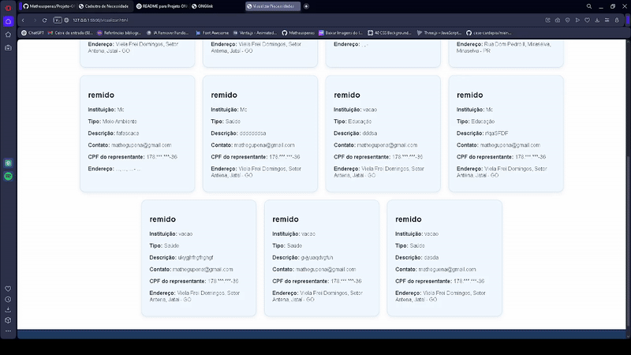

# 📄 Projeto ONGlink

Projeto web para cadastro de ONGs com formulário de inserção, listagem dinâmica e interface responsiva. Utiliza HTML, CSS e JavaScript puro, com armazenamento em `localStorage`.

## 🔍 Funcionalidades

- 📝 Formulário de cadastro de ONGs com campos como nome, email, causa, localização e descrição.
- 💾 Armazenamento dos dados diretamente no `localStorage` do navegador.
- 📊 Listagem automática das ONGs cadastradas com exibição em cards.
- 🌍 Integração com API de CEP (via [viacep.com.br](https://viacep.com.br)) para preenchimento automático de endereço.
- 🧾 Validação de CPF e EMAIL para garantir dados corretos no cadastro.

## 🚀 Teste você mesmo

- 🌐 GitHub Pages: [Projeto ONGlink](https://matheuspenas.github.io/Projeto-ONGlink/)
- 💻 Repositório no GitHub: [matheuspenas/Projeto-ONGlink](https://github.com/Matheuspenas/Projeto-ONGlink)

## 🖥️Demoatrações

# Demostração da pagina inicial

# Demostração da pagina de cadastro

# Demostração da pagina de visualização de Necessidade

## 💻 Tecnologias utilizadas

- HTML5
- CSS3
- JavaScript (vanilla)
- `localStorage` (armazenamento local no navegador)

## 🧠 Lógica do projeto

1. O formulário captura os dados inseridos pelo usuário.
2. Os dados são validados para garantir que os campos essenciais estejam preenchidos.
3. As informações são armazenadas no `localStorage`.
4. A listagem das ONGs é atualizada dinamicamente na tela.
5. A API ViaCEP é utilizada para preencher o endereço com base no CEP informado.
6. A validação de CPF e EMAIL é feita para assegurar a autenticidade dos dados inseridos.

## ✨ Interface

Design limpo, com foco na experiência do usuário:

- Estrutura clara e bem definida.
- Layout responsivo para desktop.
- Uso de cores suaves e elementos visuais intuitivos.

## 👤 Autor

**Matheus Gustavo Pena Luiz**

📧 Email: [mathegupena@gmail.com](mailto:mathegupena@gmail.com)  
💼 LinkedIn: [linkedin.com/in/matheus-gustavo-pena-luiz-07a113326](https://linkedin.com/in/matheus-gustavo-pena-luiz-07a113326)  
📸 Instagram: [@matheuspenass](https://instagram.com/matheuspenass)  
💻 GitHub: [matheuspenas](https://github.com/matheuspenas)
